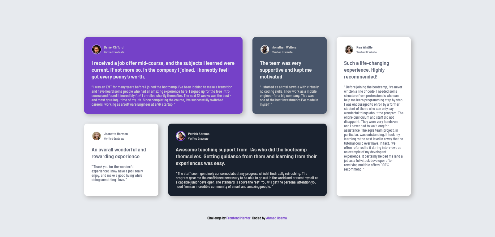

# Frontend Mentor - Testimonials grid section solution

This is a solution to the [Testimonials grid section challenge on Frontend Mentor](https://www.frontendmentor.io/challenges/testimonials-grid-section-Nnw6J7Un7). Frontend Mentor challenges help you improve your coding skills by building realistic projects.

## Table of contents

- [Overview](#overview)
  - [The challenge](#the-challenge)
  - [Screenshot](#screenshot)
  - [Links](#links)
- [My process](#my-process)
  - [Built with](#built-with)
  - [What I learned](#what-i-learned)
  - [Useful resources](#useful-resources)
- [Author](#author)

## Overview

### The challenge

Users should be able to:

- View the optimal layout for the site depending on their device's screen size

### Screenshot



### Links

- Solution URL: [Project Solution](https://www.frontendmentor.io/solutions/mobile-first-responsive-layout-testimonails-kDY7IIvj0h)
- Live Site URL: [Project live site](https://ahmed-osama99.github.io/Testimonials-grid-challange/)

## My process

### Built with

- Semantic HTML5 markup
- CSS custom properties
- Flexbox
- CSS Grid
- Mobile-first workflow

### What I learned

```css
@media screen and (min-width: 33em) {
  .testimonials-grid {
    grid-template-areas: "one one" "two three" "five five" "four four";
  }
}
@media screen and (min-width: 38em) {
  .testimonials-grid {
    grid-template-areas: "one one" "two five" "three five" "four four";
  }
}
@media screen and (min-width: 54em) {
  .testimonials-grid {
    grid-template-areas: "one one two" "five five five" "three four four";
  }
}
@media screen and (min-width: 75em) {
  .testimonials-grid {
    grid-template-areas: "one one two five" "three four four five";
  }
}
```

### Useful resources

- [Kevin powell](https://www.youtube.com/watch?v=p3_xN2Zp1TY) - This helped me to master responsive layout using grid. I really liked this pattern and will use it going forward.

## Author

- Frontend Mentor - [@Ahmed-Osama99](https://www.frontendmentor.io/profile/Ahmed-Osama99)
- Codepen - [@ahmed-osama99](https://codepen.io/ahmed-osama99)
